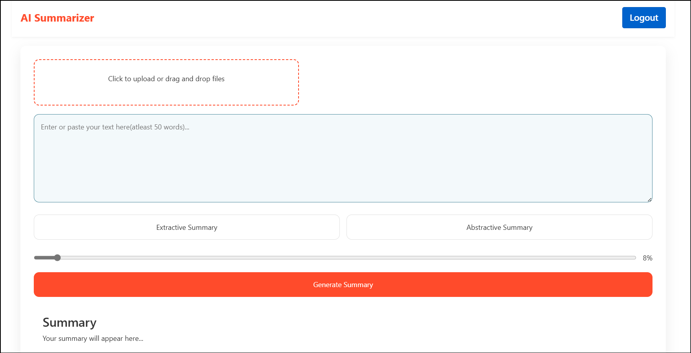

# AI_Summariser

A text summarization tool that employs both Abstractive and Extractive summarization techniques to condense large texts into concise, easy-to-understand summaries while identifying key points.

## Installation

1. Clone the repository:
   ```bash
   git clone https://github.com/Manakavoo/AI_summariser.git
   ```
   Or download the project as a ZIP file

2. Install dependencies:
   ```bash
   pip install -r requirements.txt
   ```
   (Optional: Create a virtual environment first)

3. Get your Gemini API key from [Google AI Studio](https://ai.google.dev/gemini-api/docs)

4. Add your Gemini API key to `abstractive_summarisation.py`

5. Run the application:
   ```bash
   python app.py
   ```

## Important Note

Make sure to add your Gemini API key in `abstractive_summarisation.py` before running the application.

## Demo




## Features

- **Extractive Summarization**: Identifies and extracts important sentences based on word frequency
- **Abstractive Summarization**: Uses Gemini API to generate coherent summaries with additional context
- **User Authentication**: Includes login and registration functionality
- **Customizable Output**: Sliding option to control summary length percentage
- **Web Interface**: Easy-to-use web-based interface


## Contributing

Contributions are welcome! Feel free to collaborate and submit your work through pull requests.

## Thank You!

Your interest and support are appreciated. Happy coding!